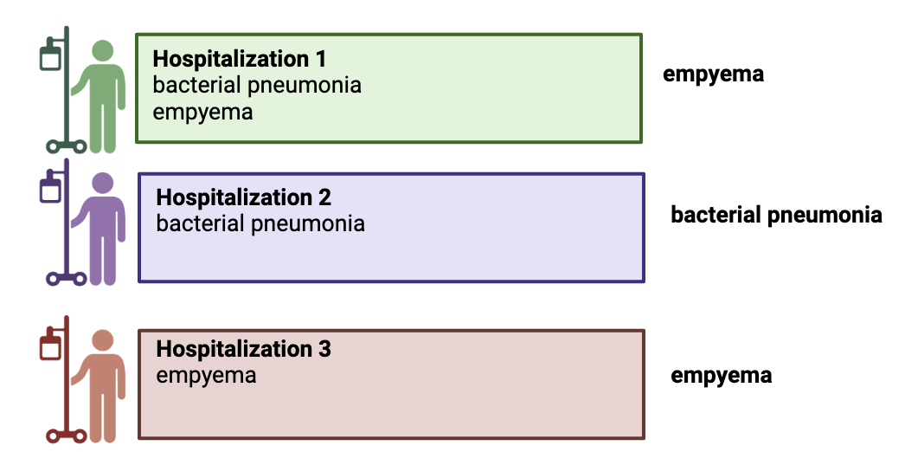

# Inclusion criteria
The *patients* inclusion criteria is **patients < 18 at the date of visit**
The *Visits* inclusion criteria includes:
    -   Inpatients (at least one hospitalization \> 1 day)
    -   Comprising at least one ICD-10 code during hospitalization
    -   Start date: January 1st, 2019
    -   End date: March 31st, 2023

# Variables that need to be checked/modified by each site
Change the values of the following variables according to your site:
1.  "folder_4ce_files": folder path where your phase 2.2 data files are
    located
2.  "obfuscation": determine the obfuscation threshold (FALSE if no
    obfuscation, or the numeric value of the obfuscation threshold if
    any)
3.  "dateFormat": specify the format of the date at your site (e.g., for
    "2021-06-24", the format would be ""%Y-%m-%d"", [see
    documentation](https://www.stat.berkeley.edu/~s133/dates.html))
4.  "data_update_date": date at which the data has been updated in the
    local datawarehouse. Used to estimate patient age at time of visit,
    since patients age in the 4CE demographic file is expected the age
    at data update.
    
```{r message=FALSE, warning=FALSE}
folder_4ce_files <- "/4ceData/Input/AllAdmin2023/"
obfuscation =  FALSE
#obfuscation = 3
dateFormat <- "%Y-%m-%d"
data_update_date <- "2022-12-01"
dir.output <- "/4ceData/bacterialInfection_outputs/"
```


# Setting up the R environment

This includes:
1. create the output directory if it does not exist 
2. create the logs file. 

```{r}
print("Creating the output folder if it doesn't exist")
if (! dir.output %in% list.dirs()) {dir.create(dir.output)}

sink(file = paste0( dir.output, "/logs_QC.txt"))
print(timestamp())
print('##########')
```

3. installing and loading the libraries
4. set up the theme plots and color palettes 
5. get the session info 

```{r libraries, message=FALSE, warning=FALSE, results='hide'}
# Install packages
source("../R/packagesInstallation.R")
# set up the theme plots
source("../R/theme_plots.R")
# get the session information
sessionInfo()
# load the local variables
source("../R/setUpVariableParameters.R")

print(paste0( 'FourCePhase2.2bacterial Infection Code version: ', codeVersion ))
print('##########')
```

# Data loading
We will use as input the 2.2 data files. Specifically:
-   LocalPatientSummary
-   LocalPatientObservation
-   LocalPatientClinicalcourse

## Reading 4CE phase 2.2 files

```{r message=FALSE, warning=FALSE}
### Read the CSV input files without duplicating the data

source("../R/readInputFiles_fread.R")

filecheck <- checkInputFilesFread( path = folder_4ce_files, separator = ",", skip = 0, verbose = TRUE )

if(filecheck){
  demo_raw <- read_delim_4ce("LocalPatientSummary.csv", folder_4ce_files, )
  obs_raw <- read_delim_4ce("LocalPatientObservations.csv", folder_4ce_files)
  clinical_raw <- read_delim_4ce("LocalPatientClinicalCourse.csv", folder_4ce_files)

  ### Extract the patient summary and observation information. 
  # arrange in a consistent way to make sure we are not assuming the order of some sites
  demo_raw <- demo_raw %>% 
    dplyr::filter(cohort == "AllAdm") %>%
    dplyr::arrange(patient_num, as.Date(admission_date, format = dateFormat), days_since_admission)
  obs_raw <- obs_raw %>% 
    dplyr::filter(cohort == "AllAdm") %>%
    dplyr::arrange(patient_num, days_since_admission)
  clinical_raw <- clinical_raw %>% 
    dplyr::filter(cohort == "AllAdm") %>%
    dplyr::arrange(patient_num, as.Date(calendar_date, format = dateFormat), days_since_admission)
  
  print('Input files successfully read, patient data extracted')
  
}else{
  print('Error in reading files')
}


```

## Select the ICD codes of interest
```{r}
#### ICD codes bacterial conditions ####
print('Reading ICD bacterial codes')
icdCodes <- read.csv("../public-data/ICD_bacterial4.csv", header = TRUE, colClasses = "character") %>%
   dplyr::mutate( concept_code = gsub("\\.", "",ICD10_Code)) %>%
   dplyr::select( disorder_group = syndrome, ICD10_Code, concept_code, description, 
                  syndrome, IBI_simple, IBI_extensive, Respiratory, Skin, bacterial_syndrome )
```

# Data-management

## Filtering on "inpatient" status

```{r}
# Filtering on inpatients here (in_hospital == 1), to reduce subsequent compute time of the encounter length calculation 
clinical_raw <- dplyr::filter(clinical_raw, in_hospital == 1)
```

## Calculating duration of individual hospitalizations

- Adding columns with hospitalization number and hospitalization length to
the clinical raw file
- Calculate 'admit date': date of admission for each hospitalization

```{r}
source("../R/count_sequences_hospitalisation.R")
clinical_raw <- count_hosp(clinical_raw)

print('Hospitalization sequences have been counted.')
```

## Calculating age at hospitalization time

```{r}
# Calculating patient age at the time of visit, assuming the age used is the patients' age at the time of extraction (last discharge date available in the data)
# removing the dots from the ICD codes (if any)
obs_raw <- as.data.frame( obs_raw )
demo_raw <- as.data.frame( demo_raw )
clinical_raw <- as.data.frame( clinical_raw )

obs_raw_age <- left_join(obs_raw, demo_raw[c("patient_num", "age")], by = c("patient_num")) %>%
  dplyr::mutate( concept_code = gsub("\\.", "",concept_code )) %>%
  dplyr::inner_join(clinical_raw[, c("patient_num", "days_since_admission", "calendar_date")], 
            by = c("patient_num", "days_since_admission"))

# estimate age at each diagnosis
obs_raw_age$age_time_diagnosis <- obs_raw_age$age - floor(as.numeric(as.Date(data_update_date, format = dateFormat) - as.Date(obs_raw_age$calendar_date, format = dateFormat)) / 365.25)

print('Patient age calculated')
```

## Applying inclusion criteria to filter and format the data

We are selecting hospitalizations based on the following criteria:

-   Associated with at least 1 ICD code

-   With a duration of hospitalization spanning over at least one
    consecutive days

-   Starting on or after 2019/01/01

-   Age at diagnosis < 18 y/o

```{r}
obs_filtered_inclusion_criteria <- obs_raw_age %>% 
  dplyr::filter(concept_type == 'DIAG-ICD10',
                days_since_admission >= 0, 
                age_time_diagnosis < 18 )

if (!time_period %in% c('day', 'week', 'month')) {
  print(paste0('unidentified time period: ', time_period))
  print(paste0('possible time periods: ', c('day', 'week', 'month')))
} else {
  print(paste0('time period: ', time_period))
}

# base the time period on admit date, not calendar date
clinical_filtered  <- clinical_raw %>%
  dplyr::filter( length_hospitalization >= min_hosp_days, 
          cohort  %in% c("AllAdm")) %>%
  dplyr::mutate( calendar_date = as.Date( calendar_date, format = dateFormat),
                 admit_date = as.Date( admit_date, format = dateFormat),
                 time_p = as.Date(cut( admit_date, breaks = time_period)),
                 period = ifelse( admit_date <= pre_NPI, "pre-NPI", 
                                  ifelse( admit_date > full_NPI, "partial-NPI", "full-NPI")))


# we create a hospitalization id and select only the columns of interest
clinical_filtered <- clinical_filtered %>%
  dplyr::mutate( hospitalization_id = paste0( patient_num, "-", n_hospitalization )) %>% # create id to each hospitaliz.
  dplyr::select( patient_num, days_since_admission, in_hospital, in_icu, dead, length_hospitalization, n_hospitalization, time_p, period, hospitalization_id ) %>%
  unique()
  

# we filter the demographic data by patients that meet the inclusion criteria
# from all the information there we select the patient id, the time patient die and sex
demographic_filtered_inclusion_criteria <- demo_raw %>%
  filter( patient_num %in% obs_filtered_inclusion_criteria$patient_num ) %>%
  select( patient_num, death_date, sex) %>%
  unique()
```

## Put all the data together in a unique table

We create a table with all the data together. 
```{r}
all_codes <- obs_filtered_inclusion_criteria %>% 
   dplyr::inner_join( clinical_filtered, 
                     by = c("patient_num", "days_since_admission")) %>% 
   dplyr::inner_join(demographic_filtered_inclusion_criteria, 
                     by = "patient_num")
```

## Adding ICU and dead status by hospitalization
We add two columns to know if in each hospitalization the patient was dead and/or in the ICU.
We need this information by hospitalization, not by day as it is here. 

```{r}
all_codes <- all_codes %>%
  dplyr::group_by( patient_num, n_hospitalization ) %>%
  dplyr::mutate( icu_in_hosp = ifelse( max(in_icu ) == 1, 1, 0 ), 
                 dead_in_hosp = ifelse( max( dead ) == 1, 1, 0 ))

```


### QC
# from here only use all_codes combined data structure? remove other dataframes?
```{r}
print("Starting QC")
source("../R/qc_summary.R")
# summary restricted to patients < 18 years old
qc_summary( input_df = all_codes, obfuscation_threshold = obfuscation, dir.output = dir.output  )

stopifnot(unique(all_codes$in_hospital) == 1)
stopifnot(unique(all_codes$length_hospitalization >= min_hosp_days))
stopifnot(length(unique(all_codes$patient_num)) == length(unique(demographic_filtered_inclusion_criteria$patient_num)))
stopifnot(length(unique(all_codes$patient_num)) == length(unique(obs_filtered_inclusion_criteria$patient_num)))
```


## Adding the age group and length of hospitalization category
```{r}
# add the age groups
ageGroups <- read.delim("../public-data/ageGroups.txt", sep="\t",  header = TRUE) 

# flag any unexpected ages
strange_ages <- all_codes %>% dplyr::filter(age_time_diagnosis<0 | age_time_diagnosis>18)
if (nrow(strange_ages) != 0) {
  print("Some strange ages were found for our patients:")
  print(unique(strange_ages$age_time_diagnosis))
}

# Filtering hospitalizations where patient age is in inclusion criteria
all_codes <- all_codes %>%
  dplyr::left_join( ageGroups, by = c("age_time_diagnosis" = "age")) %>%
  dplyr::mutate( length_hospitalization_category = ifelse( length_hospitalization < 3, "less than 3 days", 
                                                           ifelse( length_hospitalization > 7, "more than 7 days", 
                                                                   "between 3 and 7 days")) )

### print checks
print("Age summary")
print(table(all_codes$age_group, useNA = 'ifany'))
print(summary(all_codes$age_time_diagnosis))
```

### QC: do a summary of the bacterial infection ICD codes present in each site

As output we will generate a table with: the number of observations per
code, number of patients diagnosed with each code and the date range in
which the code was used.


```{r}
source('./../R/summarize_bi_codes.R')
summarize_bi_codes(all_codes, icdCodes)
# outputs saved as bacterialCodesSummary.Rdata and bacterialCodesSummary_bycode.Rdata
```

## Add the bacterial infection ICD code description and filter

```{r message=FALSE, warning=FALSE}
# Getting site name, will be used later in the analysis
site <- unique(as.character(demo_raw$siteid))
print(paste0('site id: ', site))

# add a column that will allow us to identify if the code belongs to any of the bacterial infections or not
all_codes_desc <- all_codes %>% 
  dplyr::left_join( icdCodes, by=c("concept_code") ) %>%
  dplyr::mutate(icd_code_category = ifelse(concept_code %in% icdCodes$concept_code, 
                               "bacterial", 
                               "others")) 

print(table(all_codes_desc$icd_code_category))
```

## Bacterial pneumonia and LRTI/empyema
Bacterial pneumonia and empyema is a special case. 
- If the patient in the hospitalization presents both,bacterial pneumonia and empyema we only want to keep empyema. 
- If the patient in the hospitalization only has bacterial pneumonia we keep it is
- If the patient in the hospitalization only presents empyema, then we keep it as it is.

Identify which is the subset of patients in the first scenario (having both in the same hospitalization), and remove bacterial pneumonia. 

```{r}
all_codes_desc <- all_codes_desc %>%
  dplyr::group_by(hospitalization_id) %>%
  dplyr::mutate(has_both = "LRTI/empyema" %in% disorder_group & "bacterial pneumonia" %in% disorder_group) %>%
  dplyr::filter(!(disorder_group == "bacterial pneumonia" & !is.na(disorder_group) & has_both)) %>% # remove the bacterial pneumonia rows if the hospitalization has both 
  dplyr::select(-has_both)
```


# Monthly hospitalizations

## Total (counts)
Estimate the number of monthly hospitalizations. 
For this estimate, done for QC purposes, we do not filter by any condition. 

```{r}
monthly_hospitalizations <- all_codes_desc %>%
  dplyr::filter( time_p < end_date_plots, 
                 time_p >= start_date_plots ) %>%
  dplyr::group_by( time_p ) %>%
  dplyr::summarise(count_total =  ifelse(n_distinct(hospitalization_id) > obfuscation | isFALSE(obfuscation),
                               n_distinct(hospitalization_id), 
                               0.5)) %>%
 dplyr::mutate( period = ifelse( time_p <= pre_NPI,
                           "pre-NPI", ifelse( time_p > full_NPI, "partial-NPI", "full-NPI")))
source("../R/admission_plot_count.R")
nh <- admission_plot_count(df = monthly_hospitalizations, 
                     x = "time_p",
                     y = "count_total", 
                     title = paste0("Total hospitalizations (per ", time_period,")"), 
                     y_title = "Hospitalization Count")
nh
```

## Bacterial infection related hospitalizations (counts)

```{r}
count_bacterial_hosp <- all_codes_desc %>%
  dplyr::filter( icd_code_category == "bacterial",
                 time_p < end_date_plots, 
                 time_p >= start_date_plots ) %>%
  dplyr::group_by( time_p ) %>%
  dplyr::summarise(count_bacterial =  ifelse(n_distinct(hospitalization_id) > obfuscation | isFALSE(obfuscation),
                               n_distinct(hospitalization_id), 
                               0.5)) %>%
 dplyr::mutate( period = ifelse( time_p <= pre_NPI,
                           "pre-NPI", ifelse( time_p > full_NPI, "partial-NPI", "full-NPI")))


count_perc_bact_hosp <- monthly_hospitalizations %>%
  dplyr::left_join(count_bacterial_hosp, 
            by = c("time_p", "period")) %>% 
  tidyr::replace_na(list(count_bacterial = 0)) %>%
  dplyr::mutate( percentage_bacterial = round(100*count_bacterial/count_total, 3),
                 count_no_bacterial = count_total - count_bacterial,
                 ratio = count_bacterial/count_no_bacterial )


thpd_bacterialCount <- count_perc_bact_hosp %>%
  tidyr::pivot_longer(names_to = "counts", cols=c(count_bacterial, count_total)) %>%
  dplyr::mutate( counts = ifelse( counts == "count_bacterial", "Bacterial", "Total")) %>%
  ggplot2::ggplot(aes(x = time_p, y = value, fill = counts, color = counts)) +
  ggplot2::geom_point() +
  ggplot2::geom_vline(xintercept = as.Date(pre_NPI),
             linetype = "dashed") +
  ggplot2::geom_vline(xintercept = as.Date(full_NPI),
             linetype = "dashed") +
  ggplot2::scale_fill_manual(values = cbPalette) +
  ggplot2::scale_color_manual(values = cbPalette) +
  ggplot2::labs(y = "Counts",
       x = paste0("Date (by ", time_period,")"),
       title = paste0("Per ", time_period , " number of hospitazations with bacterial infection related ICD codes")) 

thpd_bacterialCount
```

## Percentage of hospitalizations with bacterial infections
```{r}
bacterialPercentage <- admission_plot_count(df = count_perc_bact_hosp, 
                     x = "time_p",
                     y = "percentage_bacterial", 
                     title = paste0("Total hospitalizations (per ", time_period,")"), 
                     y_title = "Bacterial related hospitalization (%)")
bacterialPercentage
```


# Interrupted Time-Series Analyses (ITS)

```{r}
# Time series analysis 
hospitalization_summary <- count_perc_bact_hosp %>%
  filter(time_p > as.Date(cut( start_date_plots, breaks = time_period)) &
           time_p < as.Date(cut( end_date_plots, breaks = time_period))) %>%
  mutate(time = seq_along(time_p),
         month_year = format(time_p, "%m")
  )
```

## ITS Count based
```{r, its count based}
ts_linear_count <- lm(count_bacterial ~ period * time, hospitalization_summary)
ts_seasonal_count <- lm(count_bacterial ~ period*time + harmonic(month_year, 1, 12), hospitalization_summary)
```

### ITS Visualization: counts, no clearance period, with seasonality effect

```{r}
source("../R/time_series_analysis_plotting.R")

time_series_analysis_plotting(ts_seasonal_count,
                              hospitalization_summary,
                              "count_bacterial",
                              clearance_period = FALSE) +
  labs(title = "Interrupted Time-Series Analysis: Number of hospitalizations with bacterial infection ICD codes",
       subtitle = "With seasonality effect",
       x = time_period,
       y = "Count")
```

## ITS Percentage based
```{r, its percentage based}
ts_linear_percent <- lm(percentage_bacterial ~ period * time, hospitalization_summary)
ts_seasonal_percent <- lm(percentage_bacterial ~ period*time + harmonic(month_year, 1, 12), hospitalization_summary)
```

### ITS Visualization: percentage, no clearance period, with seasonality effect

```{r}
time_series_analysis_plotting(ts_seasonal_percent,
                              hospitalization_summary,
                              "percentage_bacterial",
                              clearance_period = FALSE) +
  labs(title = "Interrupted Time-Series Analysis: Percentage of hospitalizations with bacterial infection ICD codes",
       subtitle = "Without seasonality effect",
       x = time_period,
       y = "Percentage")
```

# Bacterial infection hospitalizations aggregating by subcategories
Load the functions. 

```{r}
source("../R/hospitalizations_estimations_subcategories.R")
source("../R/hospitalizations_visualization_subcategories.R")
```


## Disorder group

```{r}
by_disorder_group <- hospitalizations_estimation_subcategories( input_df = all_codes_desc, subcategory = "disorder_group" )
```

### Counts
```{r}
hospitalizations_visualization_subcategories( input_df = by_disorder_group, 
                                              type = "counts", 
                                              title_plot = "Hospitalizations based on bacterial infection subcategory", 
                                              subtitle_plot = "Monthly Counts")
```

### Percentages
```{r}
hospitalizations_visualization_subcategories( input_df = by_disorder_group, 
                                              type = "percentages", 
                                              title_plot = "Hospitalizations based on bacterial infection subcategory", 
                                              subtitle_plot = "Monthly Percentages")
```


## Sex

```{r}
by_sex_group <- hospitalizations_estimation_subcategories( input_df = all_codes_desc, subcategory = "sex" )
```

### Counts

```{r}
hospitalizations_visualization_subcategories( input_df = by_sex_group, 
                                              type = "counts", 
                                              title_plot = "Hospitalizations based on sex subcategory", 
                                              subtitle_plot = "Monthly Counts")
```

### Percentage
```{r}
hospitalizations_visualization_subcategories( input_df = by_sex_group, 
                                              type = "percentages", 
                                              title_plot = "Hospitalizations based on sex subcategory", 
                                              subtitle_plot = "Monthly Percentages")
```

## By age group

```{r}
by_age_group <- hospitalizations_estimation_subcategories( input_df = all_codes_desc, subcategory = "age_group" )

```

### Counts

```{r}
hospitalizations_visualization_subcategories( input_df = by_age_group, 
                                              type = "counts", 
                                              title_plot = "Hospitalizations based on age group subcategory", 
                                              subtitle_plot = "Monthly Counts")
```

### Percentage
```{r}
hospitalizations_visualization_subcategories( input_df = by_age_group, 
                                              type = "percentages", 
                                              title_plot = "Hospitalizations based on age group subcategory", 
                                              subtitle_plot = "Monthly Percentages")
```

## By ICU status

```{r}
by_icu_in_hosp <- hospitalizations_estimation_subcategories( input_df = all_codes_desc, subcategory = "icu_in_hosp" )

```

### Counts

```{r}
hospitalizations_visualization_subcategories( input_df = by_icu_in_hosp, 
                                              type = "counts", 
                                              title_plot = "Hospitalizations based on ICU status", 
                                              subtitle_plot = "Monthly Counts")
```

### Percentage
```{r}
hospitalizations_visualization_subcategories( input_df = by_icu_in_hosp, 
                                              type = "percentages", 
                                              title_plot = "Hospitalizations based on ICU status", 
                                              subtitle_plot = "Monthly Percentages")
```

## By dead status

```{r}
by_dead_in_hosp <- hospitalizations_estimation_subcategories( input_df = all_codes_desc, subcategory = "dead_in_hosp" )

```

### Counts

```{r}
hospitalizations_visualization_subcategories( input_df = by_dead_in_hosp, 
                                              type = "counts", 
                                              title_plot = "Hospitalizations based on dead status", 
                                              subtitle_plot = "Monthly Counts")
```

### Percentage
```{r}
hospitalizations_visualization_subcategories( input_df = by_dead_in_hosp, 
                                              type = "percentages", 
                                              title_plot = "Hospitalizations based on dead status", 
                                              subtitle_plot = "Monthly Percentages")
```

## Table 1

```{r}
source("../R/ttest2.R")

age_by_period <- all_codes_desc %>%
  dplyr::filter( icd_code_category == "bacterial") %>%
  distinct(patient_num, age_time_diagnosis, period) %>% 
  dplyr::group_by(period) %>%
  dplyr::summarise( mean = mean( age_time_diagnosis ),
                    sd = sd( age_time_diagnosis ),
                    count = n_distinct(patient_num))


age_test <- t.test2(m1 = age_by_period[[1, "mean"]],
                    m2 = age_by_period[[2, "mean"]],
                    s1 = age_by_period[[1, "sd"]],
                    s2 = age_by_period[[2, "sd"]],
                    n1 = age_by_period[[1, "count"]],
                    n2 = age_by_period[[2, "count"]]) %>%
  `[[`("p-value")
```

```{r}
sex <- all_codes_desc %>%
  dplyr::filter( icd_code_category == "bacterial") %>%
  dplyr::distinct(patient_num, sex) %>% 
  dplyr::group_by( sex ) %>%
  dplyr::summarise( count = n_distinct(patient_num) ) %>%
  dplyr::mutate( count = ifelse( count > obfuscation, count, obfuscation * 0.5),
                 total = sum( count ), percentage = round( count/total*100, 2)  )

sex_by_period <- all_codes_desc %>%
  dplyr::filter( icd_code_category == "bacterial") %>%
  dplyr::distinct(patient_num, period, sex) %>% 
  dplyr::group_by(period, sex ) %>%
  dplyr::summarise(count = n_distinct(patient_num)) %>%
  dplyr::group_by(period, .add=TRUE) %>%
  dplyr::mutate( count = ifelse( count > obfuscation, count, obfuscation * 0.5),
          percentage=round(count/sum( count )*100, 2)) %>%
  tidyr::replace_na(list(male = 0, female = 0))


sex_test <- sex_by_period %>%
  select(-percentage) %>%
  pivot_wider(names_from = sex, values_from = count) %>%
  ungroup() %>%
  select(male, female) %>%
  chisq.test() %>%
  `[[`("p.value")
```

```{r}
summary_diagnosis <-  all_codes_desc %>%
  dplyr::filter( icd_code_category == "bacterial") %>%
  dplyr::distinct( patient_num, description, period, time_p, concept_code ) %>%
  dplyr::group_by( concept_code, description, period ) %>%
  dplyr::count( patient_num ) %>%
  dplyr::tally(name = "count") %>%
  dplyr::mutate(count = ifelse( count > obfuscation, count, obfuscation * 0.5)) %>%
  dplyr::arrange( desc(count) ) %>%
  dplyr::ungroup()

```

```{r}
summary_disorder_group <-  all_codes_desc %>%
  dplyr::filter( icd_code_category == "bacterial") %>%
  dplyr::group_by( disorder_group ) %>%
  dplyr::count( patient_num ) %>%
  dplyr::tally(name = "count") %>%
  dplyr::mutate(count = ifelse( count > obfuscation, count, obfuscation * 0.5)) %>%
  dplyr::arrange( desc( count ))

summary_disorder_group_by_period <-  all_codes_desc %>%
  dplyr::filter( icd_code_category == "bacterial") %>%
  dplyr::distinct( patient_num, disorder_group, period, time_p ) %>%
  dplyr::group_by( period, disorder_group ) %>%
  dplyr::summarise(count = n_distinct(patient_num)) %>%
  dplyr::group_by(period, .add=TRUE) %>%
  dplyr::mutate(count = ifelse( count > obfuscation, count, obfuscation * 0.5),
         percentage = count/sum( count )*100)
```

```{r}
format_counts <- function(count, percentage) {
  glue::glue("{count} ({percentage} %)", count = count, percentage = percentage)
}


age_table1 <- age_by_period %>% 
  mutate(result = glue::glue("{mean} (sd: {sd})", mean = round(mean, 2), sd = round(sd, 2))) %>% 
  select(result, period) %>% 
  pivot_wider( names_from = period, values_from = result ) %>%
  mutate(name = "Age")


sex_table1 <- sex_by_period %>%
  bind_rows(
    sex_by_period %>%
      group_by(period) %>%
      dplyr::summarise(sex = "Total", count = sum(count), percentage = sum(percentage))
  ) %>%
  mutate(result = format_counts(count, percentage)) %>%
  select(-c(count, percentage)) %>%
  pivot_wider( names_from = period, values_from = result ) %>%
  rename(name = sex)

disorder_table1 <- summary_disorder_group_by_period %>%
  arrange(desc(count)) %>% 
  bind_rows(
    dplyr::summarise(., disorder_group="Total", across(where(is.numeric), sum))
  ) %>%
  mutate(percentage = round(percentage, 2)) %>% 
  mutate(result = format_counts(count, percentage)) %>%
  select(-c(count, percentage)) %>%
  pivot_wider( names_from = period, values_from = result ) %>%
  replace_na( list(during_pandemic = "0 (0 %)")) %>%
  rename(name = disorder_group)
```

```{r}
list_tests <- c("Sex" = sex_test,
                "Age" = age_test,
                "Diagnoses" = NA,
                "Disorder groups" = NA
)

list_table1 <- list(
  "Sex" = sex_table1,
  "Age" = age_table1,
  "Disorder groups" = disorder_table1)


tests <- list_tests %>%
  data.frame() %>%
  round(2)
names(tests) <- "pvalue"
tests["Category"] <- row.names(tests)

table1 <- list_table1 %>%
  lapply(function(df) mutate(df, across(.fns = as.character))) %>%
  dplyr::bind_rows(.id = "Category") %>%
  dplyr::left_join(tests, by = "Category")


table1 %>%
  group_by(Category) %>%
  mutate(pvalue = ifelse(duplicated(pvalue, fromLast = TRUE), "", as.character(pvalue))) %>%
  ungroup() %>%
  mutate(Category = "") %>%
  mutate(across(.cols = c(`pre-NPI`, `full-NPI`, `partial-NPI`), .fns = replace_na, "0")) %>%
  rename_with(str_to_title) %>%
  rename_with(sub, pattern = "_", replacement = " ") %>%
  mutate(across(.fns = str_to_title)) %>%
  mutate(across(.fns = sub, pattern = "_", replacement = " ")) %>%
  kable( booktabs = T) %>%
  kableExtra::kable_styling(latex_options = "striped") %>%
  kableExtra::group_rows(index = setNames(rle(table1$Category)[[1]], rle(table1$Category)[[2]]))
```
